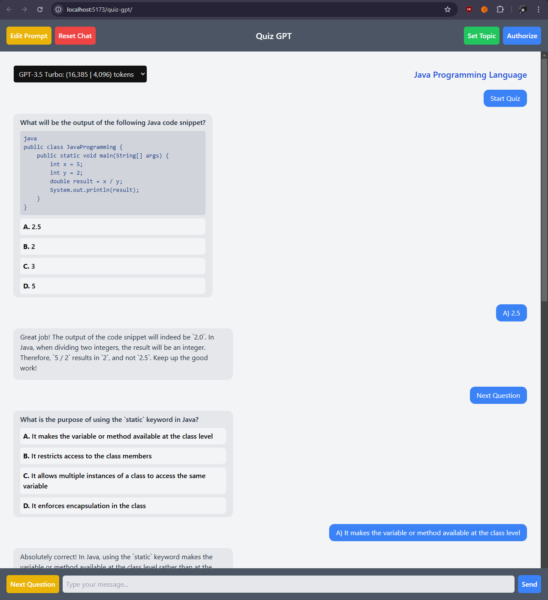

# Quiz GPT using OpenAI with Svelte

Simple college project to demonstrate the use of OpenAI's API with Svelte.
Built with a form of a quiz chat that relies on AI to create questions and answers for a defined topic.
Can be used for educational purposes or just for fun.

# Features

1. Customizable API key.
2. Customizable topic.
3. Customizable system prompt.
4. Chat reset.
5. Chat history.
6. Parsing of choices to clickable buttons.

# How to run

1. Clone the repository
2. Run `npm install`
3. Run `npm run dev`
4. Open your browser and go to `http://localhost:5173`
5. Enter the API key and the topic.
6. Start the quiz.

# Demo

## Preview

## Chatting/quiz demo

## Additional features demo

# Honorable mentions

Since I know to code, but have no priori knowledge on using Svelte:
- ChatGPT
- Copilot